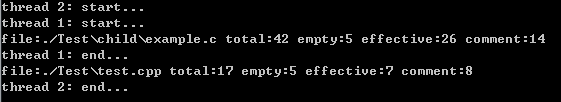

### 说明

* 目录结构
  1. 工程文件CodeCounter
  2. 编译程序在工程文件下CodeCounter/bin/Debug/CodeCounter.exe
  3. Debug目录下包含一个测试用例目录Test
  4. 当前目录中包含一个下载安装程序 

* 运行环境
  1. Windows  
  2. .net framework 4.6.1
  
* 配置环境  
  1. 下载安装.net framework
  2. 配置编译器环境变量

* 命令行使用说明
  格式：  CodeCounter  [参数1：相对路径] 
  1. 未输入参数1时默认路径为"./"
  2. 参数1可输入文件路径也可输入目录,当输入类型为目录时，统计该目录下所有文件包括其子文件中符合条件的源码。
  3. 得出结果后，程序在2s后自动停止
  4. 如有异常信息会打印显示
  
  测试结果：
  
  
 